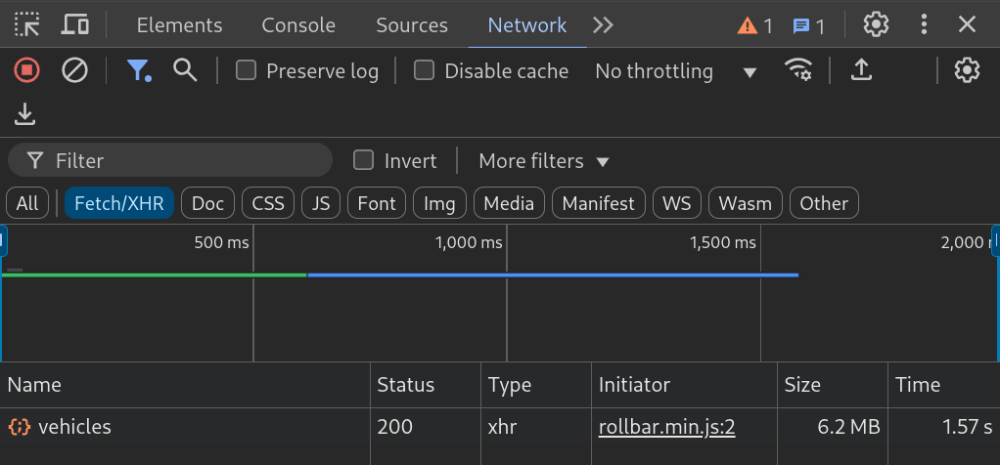

# SQL databases in your browser

&nbsp;

Erik Söhnel (github.com/hoeck)

---

# twenty years ago

&nbsp;

<Transform :scale="2">
<vscode-icons-file-type-sql/> <mdi-arrow-left-right/> <noto-v1-laptop-computer/>  <noto-v1-laptop-computer/>  <noto-v1-laptop-computer/>
</Transform>

<!--

Hi I'm Erik I'm 42 years old
and started working as junior software developer
in around 2006
on windows desktop CRM software

- uhh cyka blyat that was almost 20 years ago

- world was different

- architecture back then:
  - database server in your office
  - windows desktop app that connects to that db
  - when working out in the field / visiting customers:
    - local db (no internet back then)
    - syncs (replicates) to the main db once your're back in the office

- that was already outdated / legacy back then
  - the web platform took over
    - so much easier to just open a webpage than to
      - install a (expensive, licensed) database
      - install a windows executable with all its dependencies
      - setup database connections
      - ...
  - first all was rendered on the server
    - because early browsers where not good at running javascript
  - that all got better and more stuff was moved into the frontend
  - but was relatively limited in contrast to desktop apps
    - so you send only that part of the data that the client needs and not the whole database
    -> REST APIs

-->

---

# what happened then

&nbsp;

<Transform :scale="2">
<div style="display:flex; margin-bottom:4rem" >
<vscode-icons-file-type-sql /> <mdi-arrow-left-right/> <clarity-rack-server-line /> <mdi-arrow-left-right/> <iconoir-www /> <mdi-arrow-left-right/> <noto-v1-laptop-computer />  <noto-v1-laptop-computer />  <noto-v1-laptop-computer />
</div>
</Transform>

<!--

- web sql (stopped/abandoned in 2011)
  - only chrome implemented this
- it was actually possible to have sqlite in your browser for years
  - emscripten, ppl compliled everything to js
  - huge "binaries", slow
- there were other problems that needed to be solved (APIs, Backend Frameworks, Frontend Frameworks, UIs)
- also SQL was not cool, it was old tech and NOSQL was a hype for some time

Web SQL [Stopped 2011]

https://www.w3.org/TR/webdatabase/

https://caniuse.com/sql-storage

-->

---

# today

&nbsp;

<Transform :scale="2">
<div style="display:flex; margin-bottom:4rem" >
<vscode-icons-file-type-sql /> <mdi-arrow-left-right/> <clarity-rack-server-line /> <mdi-arrow-left-right/> <iconoir-www /> <mdi-arrow-left-right/> <noto-v1-laptop-computer />  <noto-v1-laptop-computer />  <noto-v1-laptop-computer />
</div>
</Transform>

<!--

- fast foward to '25:

- meanwhile SQL went from  "don't ever use it again for anything ever again" to "proven tech that has its uses and places where it does not work well"

- web clients are more capable than ever
  - actually chrome, nobody seems to use anything else any more
  - we can run stuff in the background: service workers
  - we have a low level intermediate language to compile: WASM
  - we have more state than ever being dealt with in the client

- but we're still using APIs to move state to the frontend

- some event argue that we should go back to early web days of rendering everything in the backend (htmx)
  - even for highly interactive apps

- what about the opposite: go back another few years to revive the tried and proven two tier architecture for the frontend?

- these where all thoughts I had but then

-->

---

# baby steps

September '22: postgres-wasm

github.com/snaplet made postgres-wasm:

<logos-postgresql/> Postgres running in the<br/><logos-firefox/> <logos-chrome/> browser _on top_ of a<br/><logos-javascript/> <logos-linux-tux/> linux emulator using a<br/><logos-javascript/> <logos-terminal/> terminal emulator to interact with it

https://github.com/snaplet/postgres-wasm

<Transform :scale="3">
<mdi-head-alert />
</Transform>

<!--

- that was cool
- it was fast
- the demo came with a js terminal emulator to interact with the linux emulator
- I managed to send stuff to it bytewise but
- bitrot: the demo is long gone
- just a demo, couldn't easily install this

-->

---

# just another dependency

Feb '24 - pglite

https://github.com/electric-sql/pglite

Just PostgreSQL compliled to Web Assembly!

```sh
$ npm install @electric-sql/pglite
```

<!--

- how hard could that be
- as easy as installing any other package
- project is not that old just a year
- part of the electric sql suite (later)
- does not neven special vite config any more
- and you're good to go for you first SQL hello world

-->

---

# hello world

```ts
import { PGlite } from "@electric-sql/pglite";

const db = new PGlite(); // a single connection
const result = await db.query("select 'Hello world' as msg;");
// {
//  "rows": [
//    {
//      "message": "Hello world"
//    }
//  ],
//  "fields": [
//    {
//      "name": "message",
//      "dataTypeID": 25
//    }
//  ],
//  "affectedRows": 0
//}
```

<!--

- that was easy

- anybody used databases before?
- you need a connection
- then you "execute" queries on it and wait for the result

- postgres in the frontend is easy
  - just a single connection
  - no users
  - started in the main thread (blocks)

- how does that sound?

-->

---

# what cost? size!

```sh
$ ls -lh react/dist.tar.gz
-rw-r--r-- 1 erik erik 62K Feb  5 22:01 react/dist.tar.gz
```

vs

```sh
$ ls -lh react-pglite/dist.tar.gz
-rw-r--r-- 1 erik erik 4.3M Feb  5 22:01 react-pglite/dist.tar.gz
```

<!--

- barebones react app (just react, 212k uncompressed)
- barebones react app + pglite (14mb uncompressed)

-> next slide (time)

-->

---

# what cost? startup time!

```ts
const start = Date.now();
const db = new PGlite();
const res = await db.query("select 'Hello world' as message");

console.log(Date.now() - start);
// ~2.5s (on my old thinkpad)
```

<!--

- quite the delay before being able to interact with the db

- mhh, mixed feelings about this
  - nowadays every first uncached site visit is just huge
    - github diff: ~6mb
    - loading gmail / slack / other chatclients: takes ages
- narrows the use cases a bit:
  - larger apps that are already bloated or are started once a day and then
    keep running (like mailclients, groupware, crms ...)
  - dev tooling, "sql playgrounds"

-> lets do it anyways: case studies

-->

---

```yaml
layout: image-right
image: ./builder-playground.png
backgroundSize: contain
```

# case study

&nbsp;

cheap **orm sql playground**

https://hoeck.github.io/typesafe-query-builder-playground/

<!--

- playground to test an query builder / orm I wrote
- like knex but for typescript
- needed a demo
- entirely deployed on gh pages
- no server interaction === cheap
- don't care about sizes or load times
- most of the time spent with figuring out how to use monaco editor

-->

---

```yaml
layout: image-right
image: ./benchmark-screenshot.png
backgroundSize: contain
```

# case study

&nbsp;

**benchmark viewer** prototype

uses react + only **sqlite** for state

<!--

- this one is more interesting
- serveral reasons why an sql database is good here
- wanted to try
- lots of relational data in the benchmark
- works quite well

-> NEXT slide use it like any other state manager

-->

---

# example code (benchmark viewer)

```ts
const BenchmarkApp() => (
  <DatabaseContextProvider>
    <ResultsTable />
  </DatabaseContextProvider>
)
```

```ts
const Graph() => (
  const results = useDatabase((db) => {
    return db.findResults();
  });

  return (
    <table>
      {results?.map((r, i) => (...))}
    </table>
  )
)
```

---

# pglite inline SQL

&nbsp;

https://pglite.dev/docs/framework-hooks/react

```ts
import { useLiveQuery } from '@electric-sql/pglite-react'

const MyComponent = () => {
  const maxNumber = 100;
  const items = useLiveQuery.sql`
    SELECT *
    FROM my_table
    WHERE number <= ${maxNumber}
    ORDER BY number;
  `

  return ...
};
```

<!--

- you can go as far as pglite does and ...
- write inline SQL !!!
- WTF that is some heavy 90s shit

-->

---

# some learnings for me

&nbsp;

<span style="color:#b00">_CHORE:_</span> the database needs a [schema](https://github.com/hoeck/typescript-runtime-type-benchmarks/blob/5d1bf0645b8340fabcc1bd81609a1e4cf59e1fee/app/src/database/schema.ts#L1-L35) first

<span style="color:#bb0">_TYPES:_</span> without a good orms/query builders, its untyped and that sucks

<span style="color:green">_FUN:_</span> listing / sorting stuff is so much easier in SQL

<span style="color:#00b">_PERF:_</span> cannot memoize from SQL don't have object identity

<!--

- from these to protos i learned
- you always need to load a schema first
  - then populate it
  - adds more load time where you can't do anything
- types
  - data you get back from the database is not typed
  - need a wrapper / orm / query builder
- using SQL in the frontend _feels_ good
- more thouhts about perf
  - cannot easily memoize objects returned from db queries
    - so you always need to render everything or manually tune object equality
- overall it feels clean
  - not sure if novelty or actual usefulness

-->

---

```yaml
layout: image-right
image: ./hg-semi-trailers.png
backgroundSize: contain
```

# why do I care?

&nbsp;

at work, users apparently like the software and use it



data always accumulates <vscode-icons-file-type-sql/> <vscode-icons-file-type-sql/>&nbsp;&nbsp;&nbsp;&nbsp;<vscode-icons-file-type-sql/><vscode-icons-file-type-sql/><vscode-icons-file-type-sql/>&nbsp;&nbsp;&nbsp;&nbsp;&nbsp;<vscode-icons-file-type-sql/><vscode-icons-file-type-sql/>&nbsp;&nbsp;<vscode-icons-file-type-sql/><vscode-icons-file-type-sql/>&nbsp;<vscode-icons-file-type-sql/><div style="display:inline-block;margin-left: 7rem"><vscode-icons-file-type-sql/></div>

<!--

- large datasets
  - not really large but 2 seconds loading time everytime the list is shown ... no
  - and its getting worse - I expect like 5 times as much data in the next 2 years
  -> sth needs to be changed
- data is already quite relational & immmutable
- I don't want paging, search on the server ...
- I don't want to implement caching or half assed frontend database
- so here I am
- got a new tool

-->

---

# recap

&nbsp;

easy to install / use / operate SQL databases exist

they have downsides

they might make some things easier than before

welcome a new <mdi-hammer/> in your toolbelt

**SQL** was already old when I started coding, 20yrs later and it looks well alive.

---

```yaml
layout: end
colorSchema: light
```

# thanks for following along

&nbsp;

[github.com/hoeck](https://github.com/hoeck)

[heavygoods.net/en/news/job-full-stack-developer](heavygoods.net/en/news/job-full-stack-developer)

[dresdenjs.io](https://dresdenjs.io)

<!--

BTW The place I work at is looking for a senior fullstack developer.

- monthly chit chat @ dresdenjs

- slides are on github

-->
